<h1 align="center">anthrex</h1>

<p align="center"><strong>A terminal multiplexer for coding agents.</strong><br>
Run many Claude Code and Codex sessions side by side, see what each one is doing, and hand a whole goal to an orchestrator that plans it, runs it in git worktrees, reviews it and waits for your approval.</p>

<p align="center">
  <a href="https://github.com/danielpina1/anthrex/actions/workflows/ci.yml"></a>
  <a href="https://github.com/danielpina1/anthrex/releases"></a>
  <a href="LICENSE"></a>
  
  
</p>

<p align="center">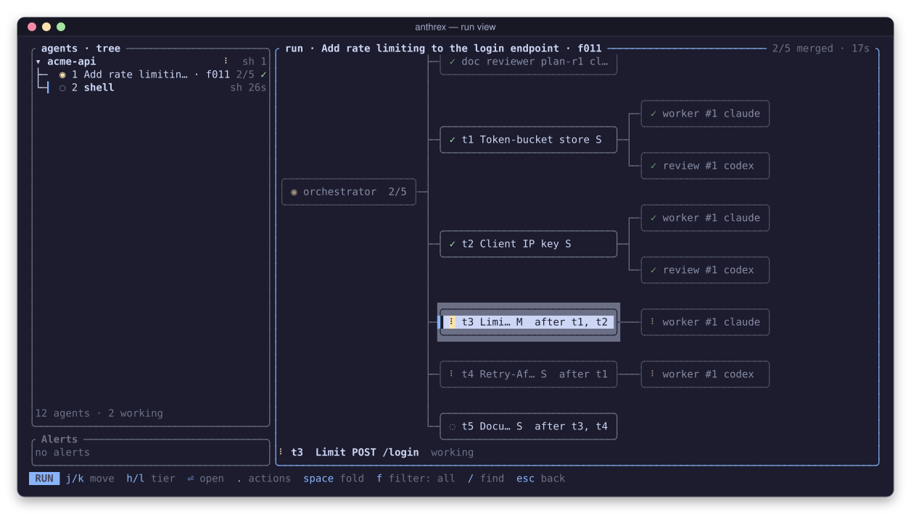</p>

## Why anthrex

Coding agents are good at a focused task and bad at being watched. Run four of them in four terminal tabs and you spend the day switching tabs to find out which one finished, which one is stuck on a permission prompt, and which one is still working. Hand one agent a large goal and you get a large, unreviewed diff.

anthrex fixes both:

- **One screen for every agent.** A background daemon owns a pseudo-terminal per agent and runs the real `claude` or `codex` app (or a shell) inside it. The client shows every agent with its live status from the agent's own hooks, and the focused one at full size. Detach, and the agents keep running; attach again from any terminal.
- **Goals, not prompts.** Give a goal to an orchestrator agent. It brainstorms with two models, writes a spec with numbered requirements, and plans small tasks. You approve each document. Then workers run each task in its own git worktree, a different agent reviews it, and a merge queue tests the merged result. Nothing reaches your branch until you accept it, and in pull-request mode anthrex never merges anything itself.

## Features

| | |
|---|---|
| **Agents side by side** | Real `claude`, `codex` and shell sessions, each in its own PTY, owned by a daemon so they survive closing the UI. |
| **Live status** | Working, waiting for you, done or idle, from each agent's hooks, with the tool it is running and a bell when one needs you. |
| **Project tree** | Agents grouped by repository, each with its sub-agents and theirs, drawn with tree connectors to any depth. |
| **Graph overview and inspector** | The same tree as a drawn graph, with a panel that spells out the selected node: model, status, branch, checkout, who spawned it. |
| **Conversation view** | A readable timeline of an agent's turns, built from its hooks and transcript: prose, folded tool calls with diffs, links to sub-agents. |
| **Git at a glance** | Branch, uncommitted work and divergence of the focused agent's checkout, kept fresh by a filesystem watcher. |
| **Worktrees** | Start an agent in a new git worktree on its own branch from the new-agent form or `anthrex new --worktree`. |
| **Persistence** | Windows, names and session ids are saved; after a restart each agent resumes its previous session. |
| **Orchestrated runs** | Goal → design → plan → workers in worktrees → review by a different agent → merge queue → your accept. |
| **Design flow** | Brainstorm (two models, merged), spec (peer-reviewed, numbered requirements), plan (coverage checked by the engine), each behind your approval. |
| **Tiered testing** | Each merge runs the tests it affects, cached by content, with flaky-test handling and a bisect when the full suite goes red. |
| **Stacked-PR delivery** | `pr` mode opens one pull request per stage; CI failures and review comments become fix tasks. You merge. |
| **Keep going** | New rounds on a finished run, and next goals on the same orchestrator. |
| **Tuning** | The run history refits size thresholds, routing and concurrency for the next run, and estimates a run before it starts. |

### Every agent, with its status

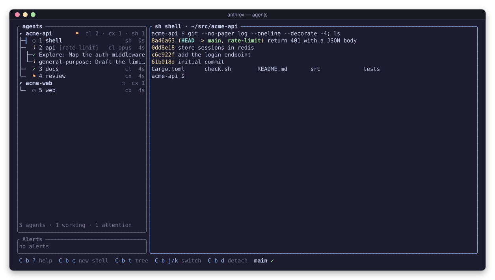

The sidebar groups agents by project. Each row shows the agent's number, status glyph, name, runtime and how long it has been in that state. A worktree agent shows its branch in brackets, and sub-agents hang under the agent that spawned them. The bottom bar shows the focused checkout's branch and whether it is clean.

### The graph overview and inspector

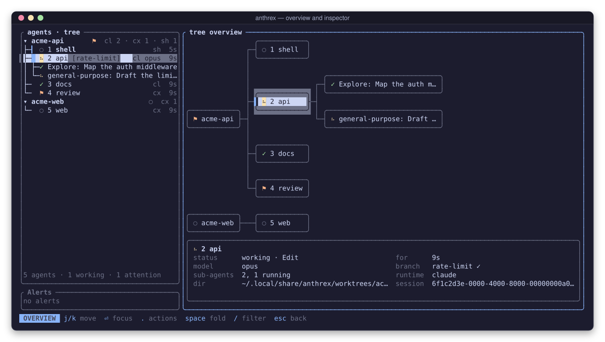

`C-b T` draws the tree as a graph you can pan with the wheel or a drag. The inspector below the canvas describes the selected node; `i` hides it.

### The conversation view

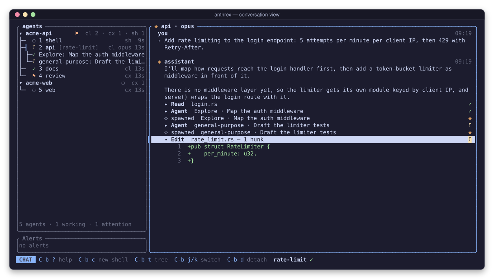

`C-b m` opens the focused agent's conversation: prompts, prose and tool calls, with Enter to unfold a call or open a sub-agent's own conversation, and `/` to search. The view is read-only; you still type to the agent in its terminal.

### New agents and worktrees

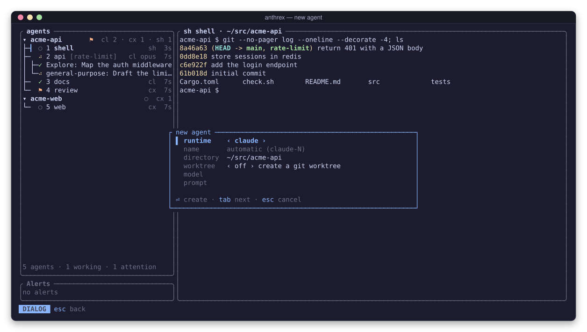

`C-b c` opens the new-agent form. Turn on **worktree** and anthrex creates a git worktree on a new branch and starts the agent there, so several agents can change the same repository without touching each other's files.

## Install

anthrex runs on **macOS and Linux**. You need:

- Rust **1.92** or newer, only to build from source;
- `git`;
- the agents you want to run: [Claude Code](https://docs.anthropic.com/en/docs/claude-code) (`claude`) and/or [Codex](https://github.com/openai/codex) (`codex`), installed and logged in;
- for `pr` delivery only, the GitHub CLI `gh`, logged in.

### From a release

Download a prebuilt binary for Linux (x86_64, arm64) or macOS (Apple silicon, Intel) from the [latest release](https://github.com/danielpina1/anthrex/releases/latest). [docs/install.md](docs/install.md) has the commands, the checksum check, and the macOS quarantine note (the binaries are unsigned).

### From source

Build and install from a clone:

```bash
git clone https://github.com/danielpina1/anthrex.git
cd anthrex
cargo install --path crates/cli     # installs the `anthrex` binary
# or: cargo build --release         # binary at target/release/anthrex
```

## Quick start

```bash
cd ~/src/my-project
anthrex                                       # start the daemon if needed and attach
```

Inside the client the prefix key is `Ctrl-b`, as in tmux. `C-b c` opens the new-agent form; pick Claude, Codex or a shell. `C-b j` / `C-b k` move between agents, `C-b d` detaches and leaves them running, and `C-b ?` shows every key.

From any other shell:

```bash
anthrex new --runtime claude --name api                    # a Claude agent in this directory
anthrex new --runtime codex --worktree fix-login --prompt "fix the flaky login test"
anthrex ls                                                 # every window and its status
anthrex attach api                                         # attach with `api` focused
anthrex daemon stop                                        # stop the daemon and every agent
```

To hand over a whole goal, press `C-b g` on a project in the tree (`C-b t`), type the goal and press `Ctrl-S`; or run:

```bash
anthrex run start --goal "add rate limiting to the login endpoint"
```

## Key bindings

Every command starts with the prefix, `C-b` by default (`prefix` in the config).

| Keys | Action |
|------|--------|
| `C-b j` / `C-b k` (or `n` / `p`) | next / previous agent |
| `C-b 1` … `C-b 9` | focus agent by number |
| `C-b c` | new agent (form) |
| `C-b ,` | rename agent |
| `C-b R` | restart agent, resuming its session |
| `C-b x` / `C-b X` | kill agent / remove agent (and its worktree) |
| `C-b m` | conversation view |
| `C-b t` | tree mode: move, fold and filter the sidebar |
| `C-b T` | overview: the tree as a graph, or an open run's run view |
| `C-b g` | start a goal |
| `C-b a` | alerts: gates and runs that need you |
| `C-b P` / `C-b S` | Profile screen / Settings screen |
| `C-b s` | toggle the sidebar |
| `C-b <` / `C-b >` | narrow / widen the sidebar |
| `C-b r` | reconnect to the daemon |
| `C-b d` | detach (agents keep running) |
| `C-b Q` | stop the daemon and every agent |
| `C-b C-b` | send a literal `C-b` |
| `C-b ?` | help, opened at the keys of whatever has focus |

Inside a view, bare keys act on it. In the tree and the overview: `j`/`k` move, `h`/`l` go to the parent or child, Enter focuses an agent or opens a run, Space folds, `/` filters, `.` opens the actions for the selected run, stage or task, and `i` toggles the inspector. The help (`C-b ?`) lists the keys of every view: the run view, the plan review, the document gates, the alerts, the conversation, the forms, Profile and Settings.

The mouse works too: click a sidebar row to focus it; the wheel scrolls, or is forwarded to programs that use the mouse. Because the client captures the mouse, use your terminal's Shift-drag to select text.

## The orchestrator

A goal becomes a **run**. One orchestrator agent, the only agent you type to, plans the run through anthrex's MCP tools. Every other agent in a run is headless and watch-only. The engine itself is deterministic: no model merges, approves or writes to your branch.

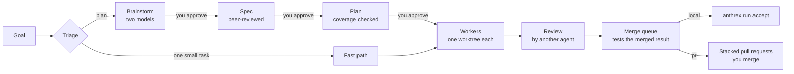

1. **Triage.** A small decider sizes the goal. One small change takes the fast path: a single task, no plan gate. Anything bigger is planned.
2. **Design flow.** For a planned code or docs goal the orchestrator runs three phases, each ending at a gate only you can open:
   - **Brainstorm.** Two models (one Claude, one Codex) explore the goal independently; the orchestrator merges their drafts into one report that shows where they agree and where they disagree.
   - **Spec.** The orchestrator writes a spec with numbered, testable requirements. An independent reviewer reads it, and the disputes the orchestrator kept are shown beside the document.
   - **Plan.** Small tasks, each with a brief, owned files, dependencies, a test mode (TDD where the task needs it) and the requirements it covers. The engine checks that every requirement is covered, and a reviewer checks the plan.

   At each gate you can approve, ask for changes with a note, edit the document yourself, reject, or go back a gate. Turn the flow off per goal (`--design off`, or the goal form's `design` row) or by default in the config.
3. **Work.** Each task runs in its own git worktree with a headless Claude or Codex worker whose model and effort match the task's size. A task passes its test proof, the project's check and a review by a different agent before it merges. Stalls, budget overruns and failures climb an escalation ladder instead of looping.
4. **Merge and test.** A merge queue merges each approved task into the run's integration branch and runs the tests the change affects, cached by content. Flaky tests are retried and proposed for quarantine; a red full suite is bisected to the merge that broke it.
5. **Deliver.** In `local` mode, `anthrex run accept` merges the finished run into your base branch. In `pr` mode, each stage of the plan becomes a stacked pull request; CI failures and review comments from people with write access become fix tasks. anthrex never merges, approves or enables auto-merge: you do.

You watch it all in the **run view** (`C-b T`, then a run): the plan as a graph of tasks by stage, each task's rounds, and an inspector for the selected task. **Alerts** (`C-b a`) collect everything waiting for you, such as a gate, a held task or a failed check, and Enter takes you to it.

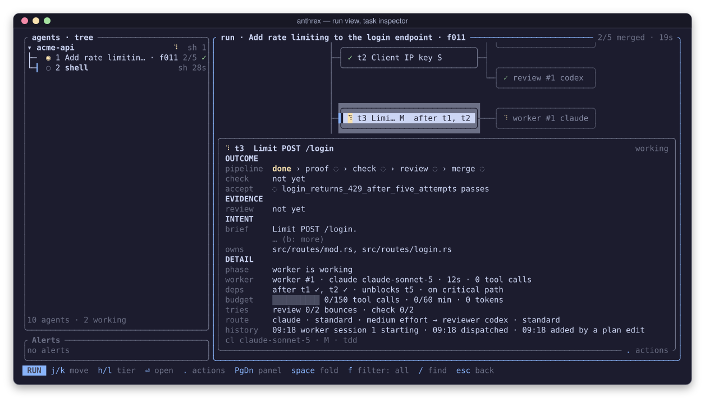

<table>
<tr>
<td width="50%">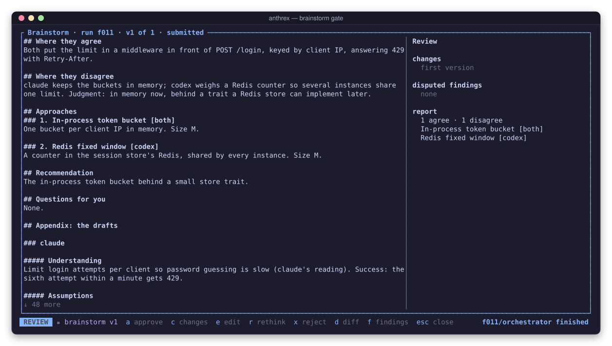<br><sub><b>Brainstorm gate.</b> The merged report, with the drafts appended.</sub></td>
<td width="50%">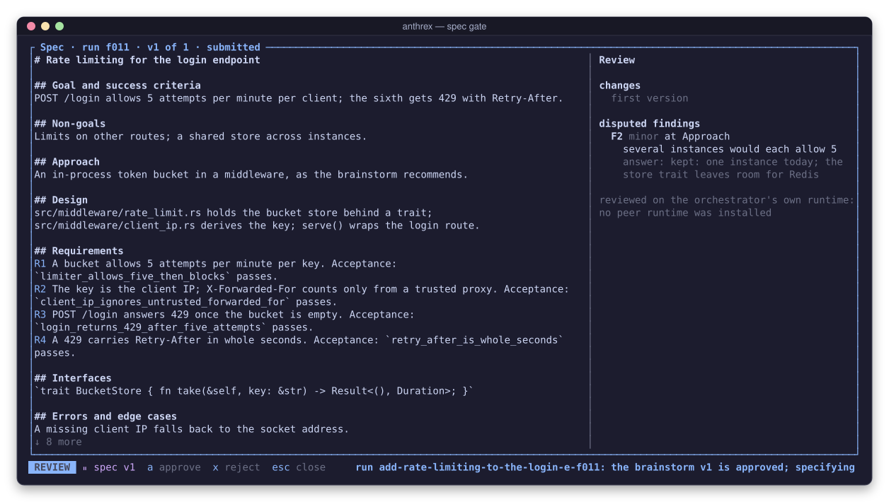<br><sub><b>Spec gate.</b> Numbered requirements; a disputed finding and its answer.</sub></td>
</tr>
<tr>
<td width="50%">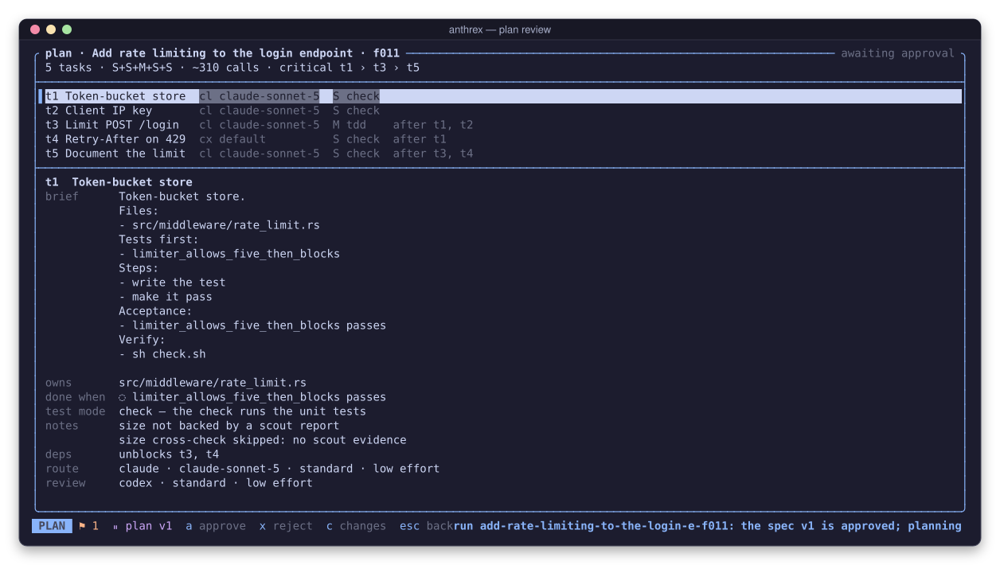<br><sub><b>Plan review.</b> Tasks, routes, dependencies and the critical path.</sub></td>
<td width="50%">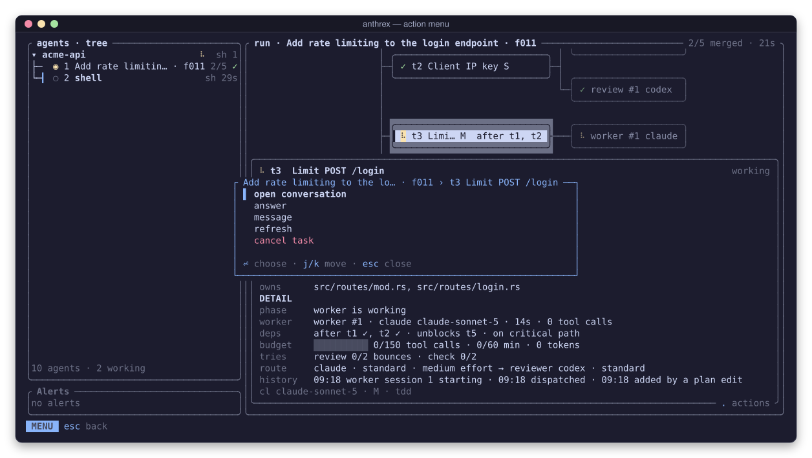<br><sub><b>Actions.</b> What you can do to a run, a stage or a task, computed by the daemon.</sub></td>
</tr>
</table>

### Keep going and tuning

- **Rounds.** `anthrex run iterate <run> "<request>"` (or the action menu) asks the orchestrator to plan a new round of a complete run; a design run amends its spec first.
- **Chains.** `anthrex run start --goal ... --continue <run>` plans a next goal with the same orchestrator, which keeps its context.
- **Repository profile.** `anthrex profile detect` has a read-only scout propose the repository's check and test commands, verifies them, and stores them only after you confirm (`anthrex profile confirm`).
- **History.** Every run is recorded. `anthrex run stats` summarises it by task class, and new runs start from what the history learned: size thresholds, concurrency and a run estimate. Settings (`C-b S`) shows and edits the models each role runs (below) and the limits.

## Configuration

anthrex reads `config.toml` from `~/Library/Application Support/anthrex/` on macOS and `~/.config/anthrex/` on Linux, or from `ANTHREX_CONFIG`. Every key is optional. An invalid or unknown key is reported and keeps its default; it never stops anthrex from starting. The Settings screen (`C-b S`) edits the file and applies most changes live.

```toml
prefix = "C-b"              # Ctrl plus a letter (not h, i, j or m)
accent = "#89b4fa"          # accent colour under truecolor
default_runtime = "shell"   # claude | codex | shell, for `anthrex new` without --runtime
scrollback_lines = 5000

[bell]
attention = true            # ring when an agent needs you
done = false                # ring when an agent finishes

[ui]
sidebar_width = 40          # 24 to 60
tree_keep_finished_secs = 300

[runtimes]
claude.command = "claude"
codex.command = "codex"

[git]
enabled = true              # the bottom bar's git segment and its watcher
poll_secs = 30              # the safety poll behind the watcher

[theme]
truecolor = "auto"          # auto (from COLORTERM) | on | off

[orchestrator]
max_writers = 3             # tasks writing at once
max_readers = 3
worker_sandbox = true

[orchestrator.design]
default = "full"            # full | off, for goals the design flow applies to
docs_dir = "docs/anthrex"   # where approved specs and plans are committed; "" = never
max_questions = 5

[testing]
test_slots = 4              # test commands at once (default: cores minus 2)

[delivery]                  # pr mode: how stage pull requests are watched
poll_secs = 60
ci_fix_max = 2
review_fix_max = 3
```

Other tables: `[conversation]` (the conversation view's limits and runtime badges), `[panes]`, and under `[orchestrator]`: `budget`, `review`, `claude`, `deciders`, `scouts`, `onboarding`, `metering`, `planners` and `tuning`. The delivery mode (`local` or `pr`) and remote are per repository, in its profile: `anthrex profile edit`.

### Models

Every model anthrex launches comes from one table, `[models]`: one row per role. A row names a `model` as `<runtime>:<model id>`, an optional `effort`, and an optional `fallback`, the model to switch to if the task struggles. A row you leave out keeps its built-in model.

```toml
[models.implementer.small]
model = "claude:claude-sonnet-5"
effort = "low"
fallback = "codex:default"      # the model Codex is set to use

[models.reviewer]
model = "codex:gpt-6-sol"
effort = "high"

[models.helpers.triage]         # one helper; the others follow [models.helpers]
model = "claude:claude-haiku-4-5"

[models.brainstorm]             # the design flow's two brainstormers
first = "claude:claude-opus-5-5"
second = "codex:default"
```

- **Rows.** `orchestrator`, `planner`, `implementer.small`, `implementer.medium`, `implementer.hub`, `test_writer`, `reviewer`, `research`, `helpers` (with `helpers.run_name`, `triage`, `size_check`, `check_summary`, `blocked_reason` and `ci_summary` to set one helper apart) and `brainstorm`. The orchestrator gives each task a size; the size picks the row. It never picks a model.
- **`codex:default`** (or `claude:default`) runs the CLI's own configured model, with no `-m` or `--model`.
- **Effort.** A task that struggles runs again at its model's next higher effort, up to the highest the CLI offers, then on the row's `fallback` (climbing its efforts too), then stays there. anthrex never switches to a model you did not name.
- **Per repository.** `<data dir>/repos/<repo>-<hash>/models.toml` holds the same `[models.*]` rows for one repository. A row there replaces the global row whole; a row it leaves out comes from `config.toml`, then the built-in.
- **Older configs.** The old keys (`[[orchestrator.models]]`, `[orchestrator.routes.*]`, `[orchestrator.agent]`, `default_runtime` and `builtin_models` under `[orchestrator]`, and the `strength`, `runtime` and `effort` of `planners`, `scouts` and `deciders`) are read as the same rows, so every role keeps its model. The file is rewritten only when you save in Settings: the old keys are removed, and the first save that removes any keeps the previous file as `config.toml.bak` (an existing `.bak` is never replaced).
- **Kept keys.** A list none of whose models anthrex knows is kept on save, with a note in the daemon's log naming the row and the model it uses meanwhile. Choose that row's model in Settings and save to remove it.

In Settings (`C-b S`), the `models` section shows the table. `⏎` picks the row's model from the list the installed `claude` and `codex` report (or `custom…` for any id), `e` cycles its effort, `f` picks its fallback, `x` resets the row, `←`/`→` switch between `everywhere` (`config.toml`) and `this repo` (`models.toml`), and `w` saves. Runs in progress keep the models they started with.

Environment variables:

| Variable | Effect |
|----------|--------|
| `ANTHREX_SOCKET`, `ANTHREX_DATA_DIR`, `ANTHREX_CONFIG` | Override the socket, the data directory and the config file. |
| `ANTHREX_GIT=off` | Disable the git watcher and probes. |
| `ANTHREX_LOG=debug` | Raise the daemon's log level. |

| File | macOS | Linux |
|------|-------|-------|
| socket | `$TMPDIR/anthrex-<uid>/daemon.sock` | `$XDG_RUNTIME_DIR/anthrex/daemon.sock` |
| log, state, runs, worktrees | `~/Library/Application Support/anthrex/` | `~/.local/share/anthrex/` |

## CLI reference

`anthrex` with no command attaches (and starts the daemon if needed). Every command takes `--dir <DIR>`, the directory new agents start in, and `--help`.

| Command | What it does |
|---------|--------------|
| `anthrex attach [TARGET]` | Attach, focusing a window by id or name. |
| `anthrex new [--runtime claude\|codex\|shell] [--name N] [--worktree BRANCH] [--model M] [--prompt P]` | Create a window and print its id. |
| `anthrex ls [--json]` | List windows. |
| `anthrex tree [--project DIR] [--json]` | Print the project tree. |
| `anthrex rename <TARGET> <NAME>` | Rename a window. |
| `anthrex restart <TARGET>` | Restart a window, resuming its session when known. |
| `anthrex kill <TARGET>` | Kill a window's process group (SIGHUP, then SIGTERM, then SIGKILL). |
| `anthrex rm <TARGET> [--worktree [--force]]` | Kill and forget a window; optionally remove its worktree (the branch is kept). |
| `anthrex daemon start [--foreground] \| stop \| status` | Manage the background daemon. |
| `anthrex profile status \| detect \| show \| confirm \| reject \| edit` | Detect, show, confirm and correct the repository's profile. |
| `anthrex run <subcommand>` | Start, watch and finish orchestrated runs (below). |

`anthrex run` subcommands:

| Subcommand | What it does |
|------------|--------------|
| `start --goal G \| --plan FILE` | Start a run from a goal or a plan file and print its id. Options: `--design full\|off`, `--delivery pr\|local`, `--orchestrator RUNTIME[:MODEL]`, `--continue RUN`, `--yes`, `--trust-project`, `--unconfined-checks`. |
| `status [RUN] [--json]` | Show every run, or one. |
| `approve RUN [--gate brainstorm\|spec\|plan] [--hold H]` | Approve a plan, a design gate or a hold. |
| `reject RUN` | Reject a plan, or cancel a hold. |
| `show`, `changes`, `edit-doc`, `rethink`, `back` | Read a design document, ask for changes, edit it yourself, brainstorm again, or go back a gate. |
| `edit RUN --file FILE` | Apply a file of plan edits. |
| `message RUN TO TEXT`, `refresh` | Message a task's worker, delivered when its turn ends; merge the run's latest work into a task's branch. |
| `retry`, `override`, `cancel`, `resume` | Retry a task, merge a task without its review's approval, cancel or resume a run. |
| `iterate RUN TEXT` | Start a new round of a complete run, which its orchestrator plans. |
| `promote RUN` | Turn a fast-path run into a planned run with an orchestrator. |
| `prs RUN`, `deliver`, `watch` | `pr` mode: show each stage's pull request, deliver a stage now, stop or resume watching. |
| `accept RUN`, `discard RUN` | Merge a complete run into its base branch, or discard it. |
| `stats` | Summarise this repository's run history by task class. |

## Architecture

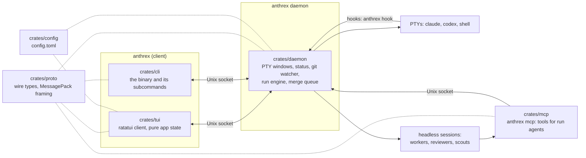

- **`crates/daemon`** owns one pseudo-terminal per window and parses each agent's hooks into a status state machine. It also runs the orchestration engine: the task graph, headless sessions, gates, the merge queue and the journal. Blocking work (git, process spawns, file I/O) never runs under its locks.
- **`crates/tui`** is the client. Its application state is pure: key handling returns effects, and rendering only reads the state.
- **`crates/proto`** holds the wire types and the length-prefixed MessagePack framing that every client shares, with a protocol version checked at the handshake.
- **`crates/mcp`** serves the MCP tools that the orchestrator, workers, reviewers and scouts call (`anthrex mcp`, started by the daemon).
- **`crates/config`** parses `config.toml`. **`crates/fake-agent`** is a scripted stand-in for `claude` and `codex` that the tests use.

## Development

```bash
cargo build --workspace --all-targets
cargo test --workspace
cargo clippy --workspace --all-targets -- -D warnings
cargo fmt --all --check
python3 scripts/pty-smoke.py      # drives the real binary through a PTY, end to end
```

The tests never run a real agent: they use `crates/fake-agent`. The smoke test runs its own daemon on an isolated socket and data directory under `/tmp`. The screenshots in this README come from the real client, driven the same way; [`docs/screenshots.md`](docs/screenshots.md) explains how to regenerate them.

## Roadmap

[`docs/ROADMAP.md`](docs/ROADMAP.md) lists every milestone, its brief and its status. Split panes (milestone 7) are the one planned feature not built yet.

## Contributing

Contributions are welcome. [`CONTRIBUTING.md`](CONTRIBUTING.md) covers the build, the tests-first rule, commit style and the pull request flow. Coding agents working on this repository start with [`AGENTS.md`](AGENTS.md).

## License

[MIT](LICENSE) © 2026 Daniel Pina
