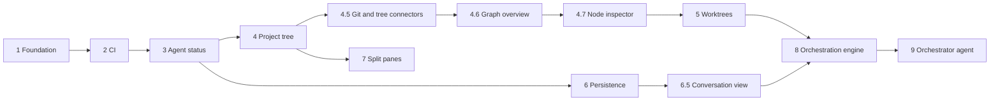

# anthrex roadmap

anthrex is built in eleven milestones. Milestones 1 to 6 are merged. Each later milestone has an implementation brief in `docs/milestones/`, written so that a coding agent such as Codex can implement it without further questions. `AGENTS.md` at the repository root holds the rules that apply to every milestone.

The design is layered, newest first:

1. `docs/superpowers/specs/2026-09-21-agent-conversation-view-design.md` — milestone 6.5: the structured conversation model and its view. Amends milestone 8's scope and milestone 9's plan gate. Where it disagrees with anything below, it wins.
2. `docs/superpowers/specs/2026-09-21-node-inspector-design.md` — milestone 4.7: the panel below the graph. Amends the document below.
3. `docs/superpowers/specs/2026-09-20-graph-overview-design.md` — milestone 4.6: the drawn graph overview and sub-agent labels. Amends §5.1 and §10.3 of the product design below.
4. `docs/superpowers/specs/2026-09-20-git-surface-and-simple-orchestration-design.md` — milestone 4.5, and the cut-down scope of milestones 8 and 9. Where it disagrees with the document below, it wins.
5. `docs/superpowers/specs/2026-09-18-anthrex-product-design.md` — milestones 2 to 9.
6. `docs/superpowers/specs/2026-09-17-anthrex-design.md` — milestone 1 and the parts of the core it still governs.

The protocol version currently on `main` is **4**, raised from 3 by milestone 4.5. Protocol numbers written in the milestone 5 to 9 briefs predate this and are wrong; each is re-derived from this line when that milestone is implemented.

## What anthrex does when all milestones are done

- Runs many Claude Code and Codex agents side by side, each as the real app in its own terminal, owned by a background daemon so agents survive closing the UI.
- Shows every project as a tree — project, then each agent session, then that session's sub-agents, then theirs — drawn with real connectors to any depth. Every node shows live state: working, needs attention, done.
- Shows the branch, uncommitted work and divergence of the focused agent's checkout, kept fresh by watching the filesystem.
- Shows several agents at once in split panes.
- Creates agents from a form, each optionally in its own git worktree, and restarts them in their previous session after a reboot.
- Runs an orchestration: you pick the orchestrator's runtime and model and give it a goal. It plans tasks and dispatches each one to a Claude or Codex worker with a model suited to the task. Every task runs in its own worktree and is reviewed by a different agent before it is merged into a run branch. Nothing reaches your base branch until you accept the result.

## Milestones

| # | Milestone | Brief | Depends on | Status |
|---|-----------|-------|------------|--------|
| 1 | Foundation: daemon, PTY windows, sidebar, CLI | `docs/superpowers/plans/2026-09-17-anthrex-foundation.md` | none | `done` |
| 2 | Continuous integration | `docs/milestones/M2-ci.md` | 1 | `done` |
| 3 | Agent status and sub-agent tracking from hooks | `docs/milestones/M3-agent-status.md` | 2 | `done` |
| 4 | Project tree view | `docs/milestones/M4-project-tree.md` | 3 | `done` |
| 4.5 | Git status in the bottom bar, and tree connectors | `docs/milestones/M4.5-git-and-tree.md` | 4 | `done` |
| 4.6 | Graph overview, and sub-agent labels worth reading | `docs/milestones/M4.6-graph-overview.md` | 4.5 | `done` |
| 4.7 | The node inspector | `docs/milestones/M4.7-node-inspector.md` | 4.6 | `done` |
| 5 | New-agent dialog and git worktrees | `docs/milestones/M5-worktrees.md` | 4.7 | `done` |
| 6 | Persistence, resume, rename, config, reconnect | `docs/milestones/M6-persistence.md` | 3 | `done` |
| 6.5 | Agent conversation view: structured turns, folded tool calls, sub-agent links | `docs/milestones/M6.5-conversation-view.md` | 6 | `ready` |
| 7 | Split panes | `docs/milestones/M7-split-panes.md` | 4 | `blocked` |
| 8 | Orchestration engine: runs, tasks, worktrees, review and merge | `docs/milestones/M8-orchestration-engine.md` | 5, 6 | `blocked` |
| 9 | Orchestrator agent: planning, model routing, review loop, plan and finish views | `docs/milestones/M9-orchestrator-agent.md` | 8 | `blocked` |

Work the milestones in numerical order, with one agreed exception: **milestone 7 is deferred** until after the orchestrator, because nothing in 6.5, 8 or 9 depends on split panes and the orchestration work is what is wanted next. The order to follow is **5 → 6 → 6.5 → 8 → 9**, then 7.

Only one milestone should be in progress at a time: they all touch the protocol and the client state.

## Why this order

- **CI first.** Every later milestone is implemented by an agent. Automated checks on every pull request catch regressions before a human reviews them.
- **The graph before worktrees.** Milestone 4.6 is small, entirely client-side, and changes no protocol message, so it can land without colliding with milestone 5's protocol bump. Its sub-agent label fix is also what makes a node box worth drawing.
- **Git state before worktrees.** Milestone 4.5 builds the watcher and the per-worktree git probe that milestone 5 needs the moment agents get their own checkouts, and that milestone 8 needs again to decide whether a task is finished.
- **Status before the tree.** The tree is only as good as the state it shows. Milestone 3 makes status exact and records sub-agents; milestone 4 draws them.
- **Worktrees before orchestration.** Parallel workers must never edit the same checkout.
- **Persistence before orchestration.** An orchestration run can last hours; it must survive a daemon restart.
- **The conversation view before the engine.** Milestone 6.5 is how an orchestrated run is watched. Built after milestone 8, the first runs would be observed through raw terminal panes — the exact problem it removes. It also needs milestone 6's `config.toml` for its caps and badges, and milestone 9's plan view reuses its rendering.
- **Engine before agent.** Milestone 8 makes runs, worktrees, reviews and merges work deterministically from a plan file, testable without any model. Milestone 9 then puts a model in charge of the decisions.

## Definition of done for every milestone

1. Every task in the brief is implemented, or its brief's "Implementation notes" explain precisely why not.
2. `cargo build --workspace --all-targets`, `cargo test --workspace`, `cargo clippy --workspace --all-targets -- -D warnings`, `cargo fmt --all --check` and `python3 scripts/pty-smoke.py` pass locally and in CI.
3. The brief's manual check has been done by a human, or is listed as outstanding in the pull request.
4. Findings that were deferred are recorded in `docs/superpowers/plans/2026-09-17-anthrex-foundation-followups.md`.
5. This table shows the milestone as `done`, and the next milestone whose dependencies are now all done is set to `ready`.
