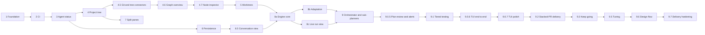

# anthrex roadmap

anthrex is built in twenty milestones. Milestones 1 to 6.5, 8a to 8c, and 9 to 9.5 (9, 9.0.5, 9.1, 9.0.6, 9.0.7, 9.2, 9.3 and 9.5) are merged, and milestone 9.6 is done and awaits its merge; milestone 7 is deferred. Each later milestone has an implementation brief in `docs/milestones/`, written so that a coding agent such as Codex can implement it without further questions. `AGENTS.md` at the repository root holds the rules that apply to every milestone.

The design is layered, newest first:

-1. `docs/superpowers/specs/2026-10-04-design-flow-design.md` — milestone 9.6: the design flow (two independent brainstorms merged into one report, a peer-reviewed spec with numbered requirements, a plan whose coverage the engine checks, each approved by the user). Where it disagrees with anything below on a matter it covers, it wins.
0. `docs/superpowers/specs/2026-10-01-tui-end-to-end-design.md` — milestones 9.0.6 and 9.0.7: the TUI end to end (the daemon-computed action menu, its forms and confirmation pages, the Profile and Settings screens, run stats, the settings protocol and live reload) and a design kit, then the polish of every existing screen to that kit. Builds on the milestone 9.0.5 brief and the adaptive orchestrator spec; where they disagree on a TUI matter, it wins.
1. `docs/superpowers/specs/2026-09-26-tiered-testing-and-pr-delivery-design.md` — milestones 9.1 and 9.2: tiered testing and stacked-PR delivery, plus orchestrator-to-worker messaging (its §12), which joins milestone 9. Amends the adaptive orchestrator spec below; its §11 lists exactly what it replaces. Where the two disagree, it wins.
2. `docs/superpowers/specs/2026-09-22-adaptive-orchestrator-design.md` — milestones 8a, 8b, 8c, 9 and 9.5: the adaptive orchestrator. Replaces the orchestration parts of every document below (its §18 lists exactly what), and replaces the old milestone 8 and 9 briefs.
3. `docs/superpowers/specs/2026-09-21-agent-conversation-view-design.md` — milestone 6.5: the structured conversation model and its view. Amends milestone 8's scope and milestone 9's plan gate. Where it disagrees with anything below, it wins.
4. `docs/superpowers/specs/2026-09-21-node-inspector-design.md` — milestone 4.7: the panel below the graph. Amends the document below.
5. `docs/superpowers/specs/2026-09-20-graph-overview-design.md` — milestone 4.6: the drawn graph overview and sub-agent labels. Amends §5.1 and §10.3 of the product design below.
6. `docs/superpowers/specs/2026-09-20-git-surface-and-simple-orchestration-design.md` — milestone 4.5, and the cut-down scope of milestones 8 and 9. Where it disagrees with the document below, it wins.
7. `docs/superpowers/specs/2026-09-18-anthrex-product-design.md` — milestones 2 to 9.
8. `docs/superpowers/specs/2026-09-17-anthrex-design.md` — milestone 1 and the parts of the core it still governs.

The protocol version is **10** once milestone 9 merges, raised from 9 (milestone 8c's) by milestone 9, **11** once milestone 9.0.5 merges, raised from 10 by milestone 9.0.5, **12** once milestone 9.1 merges, raised from 11 by milestone 9.1, **13** once milestone 9.0.6 merges, raised from 12 by milestone 9.0.6, **14** once milestone 9.2 merges, raised from 13 by milestone 9.2, **15** once milestone 9.3 merges, raised from 14 by milestone 9.3, **16** once milestone 9.5 merges, raised from 15 by milestone 9.5, and **17** once milestone 9.6 merges, raised from 16 by milestone 9.6 (`crates/proto/src/lib.rs`). Milestone 9.0.7 changes no message and stays at 13. Protocol numbers written in the milestone 9.2 to 9.5 briefs predate this and are re-derived from this line when each milestone is implemented: milestone 9.2's brief says 12, and becomes **14**.

## What anthrex does when all milestones are done

- Runs many Claude Code and Codex agents side by side, each as the real app in its own terminal, owned by a background daemon so agents survive closing the UI.
- Shows every project as a tree — project, then each agent session, then that session's sub-agents, then theirs — drawn with real connectors to any depth. Every node shows live state: working, needs attention, done.
- Shows the branch, uncommitted work and divergence of the focused agent's checkout, kept fresh by watching the filesystem.
- Shows several agents at once in split panes.
- Creates agents from a form, each optionally in its own git worktree, and restarts them in their previous session after a reboot.
- Runs an orchestration: you give a goal to one orchestrator, the only agent you type to. It scouts the repository, sizes the work into small and medium tasks (splitting anything large, with sub-planners for big goals), and dispatches each to a headless Claude or Codex worker whose model, effort and test mode (TDD when the task needs it) match the task. Every task runs in its own worktree, passes a test proof, the check and a review by a different agent, and merges through a queue that tests the merged result. You watch it all live in the `C-b T` run view. Nothing reaches your base branch until you accept the result.

## Milestones

| # | Milestone | Brief | Depends on | Status |
|---|-----------|-------|------------|--------|
| 1 | Foundation: daemon, PTY windows, sidebar, CLI | `docs/superpowers/plans/2026-09-17-anthrex-foundation.md` | none | `done` |
| 2 | Continuous integration | `docs/milestones/M2-ci.md` | 1 | `done` |
| 3 | Agent status and sub-agent tracking from hooks | `docs/milestones/M3-agent-status.md` | 2 | `done` |
| 4 | Project tree view | `docs/milestones/M4-project-tree.md` | 3 | `done` |
| 4.5 | Git status in the bottom bar, and tree connectors | `docs/milestones/M4.5-git-and-tree.md` | 4 | `done` |
| 4.6 | Graph overview, and sub-agent labels worth reading | `docs/milestones/M4.6-graph-overview.md` | 4.5 | `done` |
| 4.7 | The node inspector | `docs/milestones/M4.7-node-inspector.md` | 4.6 | `done` |
| 5 | New-agent dialog and git worktrees | `docs/milestones/M5-worktrees.md` | 4.7 | `done` |
| 6 | Persistence, resume, rename, config, reconnect | `docs/milestones/M6-persistence.md` | 3 | `done` |
| 6.5 | Agent conversation view: structured turns, folded tool calls, sub-agent links | `docs/milestones/M6.5-conversation-view.md` | 6 | `done` |
| 7 | Split panes | `docs/milestones/M7-split-panes.md` | 4 | `blocked` |
| 8 | ~~Orchestration engine~~ — superseded by 8a, 8b, 8c | `docs/milestones/M8-orchestration-engine.md` | — | `superseded` |
| 8a | Orchestration engine core: task graph, headless sessions, gates, merge queue, escalation, journal | `docs/milestones/M8a-orchestration-engine-core.md` | 5, 6, 6.5 | `done` |
| 8b | Adaptation: repo profile, scouts, deciders, fast path, output filter, metering, run history | `docs/milestones/M8b-adaptation.md` | 8a | `done` |
| 8c | The live run view in `C-b T` and the run inspector | `docs/milestones/M8c-live-run-view.md` | 8a | `done` |
| 9 | ~~Orchestrator agent~~ — superseded by the new 9 brief below | `docs/milestones/M9-orchestrator-agent.md` | — | `superseded` |
| 9 | Orchestrator and sub-planners: planning, steering, plan gate, worker messaging and refresh, role-routing history, TUI goal start | `docs/milestones/M9-orchestrator-and-subplanners.md` | 8a, 8b, 8c | `done` |
| 9.0.5 | Plan review screen, the Alerts box, and the task panel's goal, live status and result | `docs/milestones/M9.0.5-plan-review-and-alerts.md` | 9 | `done` |
| 9.1 | Tiered testing: affected-set tiers, test scheduler, result cache, flake handling, bisect, stages | `docs/milestones/M9.1-tiered-testing.md` | 9, 9.0.5 | `done` |
| 9.0.6 | TUI end to end: design kit, daemon-computed action menu with forms and confirmation pages, Profile and Settings screens, run stats, settings protocol and live reload | `docs/milestones/M9.0.6-tui-end-to-end.md` | 9.1 | `done` |
| 9.0.7 | TUI polish: every existing screen moved to the 9.0.6 design kit (alerts, task panel, run view, plan review, sidebar, status bar, help, dialogs) | `docs/milestones/M9.0.7-tui-polish.md` (written 2026-10-01; refreshed by its task 1) | 9.0.6 | `done` |
| 9.2 | Stacked-PR delivery: CI and review comments become fix tasks; anthrex never merges | `docs/milestones/M9.2-pr-delivery.md` | 9.0.7 | `done` |
| 9.3 | Keep going: a nano-like goal editor, rounds that iterate a complete run, and next goals on the same orchestrator | `docs/milestones/M9.3-keep-going.md` | 9.2 | `done` |
| 9.5 | Tuning: history refit and proposals, model lists, the run estimate, adaptive concurrency, race and test-writer patterns, the Codex output filter, and the follow-ups folded into it (orchestrator first-turn reliability, history and stats correctness, small fixes) | `docs/milestones/M9.5-tuning.md` | 9.3 | `done` |
| 9.6 | Design flow: brainstorm (two models, merged), spec (peer-reviewed, numbered requirements), plan (engine-checked coverage), each approved by the user; protocol 17 | `docs/milestones/M9.6-design-flow.md` | 9.5 | `done` |
| 9.7 | Delivery hardening (moved here from after 9.5 at the user's request): a merged stage's fix tasks, an unviewed merge checked with git, decided holds trimmed, the tier-3 mark of an open PR, the CI bisect over the whole line; protocol stays 17 | `docs/milestones/M9.7-delivery-hardening.md` | 9.6 | `ready` |

Work the milestones in numerical order, with one agreed exception: **milestone 7 is deferred** until after the orchestrator, because nothing in 6.5, 8 or 9 depends on split panes and the orchestration work is what is wanted next. The order to follow is **5 → 6 → 6.5 → 8a → (8b and 8c, in either order) → 9 → 9.0.5 → 9.1 → 9.0.6 → 9.0.7 → 9.2 → 9.3 → 9.5 → 9.6 → 9.7**, then 7. Milestones 9.0.6 and 9.0.7 go before the rest of 9.2 by the user's choice (spec `2026-10-01-tui-end-to-end-design.md` §0). Milestones 8b and 8c both need only 8a and touch different crates (8b the daemon, 8c the client), but they share the protocol version, so run them one after the other, not at once.

Only one milestone should be in progress at a time: they all touch the protocol and the client state.

```mermaid
flowchart LR
  M1[1 Foundation] --> M2[2 CI]
  M2 --> M3[3 Agent status]
  M3 --> M4[4 Project tree]
  M4 --> M45[4.5 Git and tree connectors]
  M45 --> M46[4.6 Graph overview]
  M46 --> M47[4.7 Node inspector]
  M47 --> M5[5 Worktrees]
  M3 --> M6[6 Persistence]
  M4 --> M7[7 Split panes]
  M5 --> M8a[8a Engine core]
  M6 --> M65[6.5 Conversation view]
  M65 --> M8a
  M8a --> M8b[8b Adaptation]
  M8a --> M8c[8c Live run view]
  M8b --> M9[9 Orchestrator and sub-planners]
  M8c --> M9
  M9 --> M905[9.0.5 Plan review and alerts]
  M905 --> M91[9.1 Tiered testing]
  M91 --> M906[9.0.6 TUI end to end]
  M906 --> M907[9.0.7 TUI polish]
  M907 --> M92[9.2 Stacked-PR delivery]
  M92 --> M93[9.3 Keep going]
  M93 --> M95[9.5 Tuning]
  M95 --> M96[9.6 Design flow]
  M96 --> M97[9.7 Delivery hardening]
```

## Why this order

- **CI first.** Every later milestone is implemented by an agent. Automated checks on every pull request catch regressions before a human reviews them.
- **The graph before worktrees.** Milestone 4.6 is small, entirely client-side, and changes no protocol message, so it can land without colliding with milestone 5's protocol bump. Its sub-agent label fix is also what makes a node box worth drawing.
- **Git state before worktrees.** Milestone 4.5 builds the watcher and the per-worktree git probe that milestone 5 needs the moment agents get their own checkouts, and that milestone 8 needs again to decide whether a task is finished.
- **Status before the tree.** The tree is only as good as the state it shows. Milestone 3 makes status exact and records sub-agents; milestone 4 draws them.
- **Worktrees before orchestration.** Parallel workers must never edit the same checkout.
- **Persistence before orchestration.** An orchestration run can last hours; it must survive a daemon restart.
- **The conversation view before the engine.** Milestone 6.5 is how an orchestrated run is watched. Built after milestone 8, the first runs would be observed through raw terminal panes — the exact problem it removes. It also needs milestone 6's `config.toml` for its caps and badges, and milestone 9's plan view reuses its rendering.
- **Engine before agent.** Milestone 8a makes runs, worktrees, reviews and merges work deterministically from a plan file, testable without any model. Milestone 9 then puts a model in charge of the planning.
- **Adaptation and the view before the orchestrator.** The orchestrator plans from 8b's repo profile and scout reports, and the user approves its plan in 8c's run view.
- **Tuning last.** Milestone 9.5 refits thresholds from run history, which only exists once real runs have happened.

## Definition of done for every milestone

1. Every task in the brief is implemented, or its brief's "Implementation notes" explain precisely why not.
2. `cargo build --workspace --all-targets`, `cargo test --workspace`, `cargo clippy --workspace --all-targets -- -D warnings`, `cargo fmt --all --check` and `python3 scripts/pty-smoke.py` pass locally and in CI.
3. The brief's manual check has been done by a human, or is listed as outstanding in the pull request.
4. Findings that were deferred are recorded in `docs/superpowers/plans/2026-09-17-anthrex-foundation-followups.md`.
5. This table shows the milestone as `done`, and the next milestone whose dependencies are now all done is set to `ready`.
